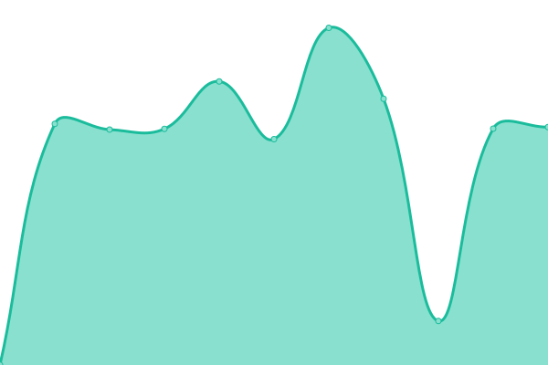

# [📈 Status Actuel](https://status.pulsar-hosting.fr): <!--live status--> **Tous les services sont opérationnels**

This repository contains the open-source uptime monitor and status page for [Pulsar Hosting](https://pulsar-hosting.fr), powered by [Upptime](https://github.com/upptime/upptime).

With [Upptime](https://upptime.js.org), you can get your own unlimited and free uptime monitor and status page, powered entirely by a GitHub repository. We use [Issues](https://github.com/pulsar-hosting/status-page/issues) as incident reports, [Actions](https://github.com/pulsar-hosting/status-page/actions) as uptime monitors, and [Pages](https://status.pulsar-hosting.fr) for the status page.

## [📈 Live Status](https://demo.upptime.js.org): <!--live status--> **Tous les services sont opérationnels**

<!--start: status pages-->
<!-- This summary is generated by Upptime (https://github.com/upptime/upptime) -->
<!-- Do not edit this manually, your changes will be overwritten -->
<!-- prettier-ignore -->
| URL | Status | History | Response Time | Uptime |
| --- | ------ | ------- | ------------- | ------ |
|  [Site vitrine](https://pulsar-hosting.fr/) | Up | [site-vitrine.yml](https://github.com/pulsar-hosting/status-page/commits/HEAD/history/site-vitrine.yml) | 

 2425ms
     
 | 

<a href="https://status.pulsar-hosting.fr/history/site-vitrine">99.03%</a>
    

|  [Espace Client](https://my.pulsar-hosting.fr/) | Up | [espace-client.yml](https://github.com/pulsar-hosting/status-page/commits/HEAD/history/espace-client.yml) | 

 1306ms
     
 | 

<a href="https://status.pulsar-hosting.fr/history/espace-client">99.04%</a>
    

<!--end: status pages-->

[**Visit our status website →**](https://status.pulsar-hosting.fr)

## 📄 License

- Powered by: [Upptime](https://github.com/upptime/upptime)
- Code: [MIT](./LICENSE) © [Pulsar Hosting](https://pulsar-hosting.fr)
- Data in the `./history` directory: [Open Database License](https://opendatacommons.org/licenses/odbl/1-0/)
